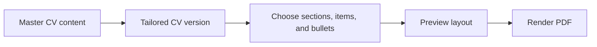
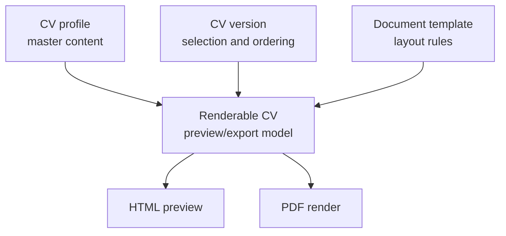

# CV Control

https://github.com/wujekd/cv-control

## The Problem

Applying for different roles usually means making small changes to the same CV again and again.

One role needs more emphasis on interface work. Another needs more detail about backend systems. Another should show different projects, a shorter summary, or a slightly different ordering of sections.

Doing this manually works for one or two applications, but it becomes frustrating quickly when applying to many jobs.

## The Solution

CV Control is an Electron desktop app for managing a CV as structured content instead of a single document.

- keep one master CV with all reusable content
- create different CV versions for different applications
- choose which sections, entries, and bullet points appear in each version
- preview the result while editing
- render a clean PDF when the version is ready

Instead of manually editing copied documents, the user works from a single source of truth and creates tailored outputs from it.

The app is local-first. The CV data lives on the machine, the editor runs in a desktop window, and PDF rendering happens through a local pipeline.

## Core Workflow

This makes it faster to prepare a CV for a new role because most of the work becomes selection and adjustment rather than manual document editing.

The goal is to make the common CV tailoring workflow faster and more reliable.

## Version-Based Editing

Each CV version can be adjusted for a specific application.

For example, a version for a design-heavy role might show more interface and product work, while another version might prioritise APIs, data modelling, and infrastructure.

Both versions can still use the same master content.

If a project description or experience bullet needs to be improved, it can be changed in the master content and then reused across versions. That avoids the problem where different copied CV files slowly drift apart and become difficult to maintain.

## Preview And PDF Rendering

The app uses a hybrid preview system.

HTML preview is used for fast feedback while editing. This keeps the desktop editor responsive and practical during normal use.

PDF preview is handled through a local rendering pipeline, so the final output can be checked separately from the live editor view.

This matters because a CV is ultimately judged as a document. It needs to fit cleanly, export properly, and remain readable as a PDF.

## Why Electron

CV Control is built as a desktop app because the workflow is personal, local, and document-focused.

Electron provides the application shell: a normal desktop window, packaged distribution, and access to app-specific local storage. Inside that shell, the editor can still use React, Vite, and TypeScript for the interactive interface.

The desktop app also runs its supporting services locally. In packaged builds, the API is embedded inside the app and uses a local SQLite database for persistence. The user does not need to run a separate server or manage a hosted backend.

That shape fits the product: open the app, edit structured CV content, preview the result, render a PDF.

## The Implementation

The project is built as a TypeScript monorepo with desktop, renderer, API, and shared packages.

The current stack includes:

- Electron for the desktop application shell
- React, Vite, and TypeScript for the renderer interface
- Zustand for editor state
- Node and Express for the embedded local API
- SQLite for local persistence
- Tectonic for PDF rendering
- a shared TypeScript package for CV data models and rendering logic

The shared package is important because both preview paths rely on the same core document model.

The editor does not invent one version of the CV while the PDF renderer renders another. The app builds a shared renderable CV model first, then uses that model for preview and PDF output.

## Data Model

The main data model is split into:

- **CV profile** - the master content
- **CV version** - the selected content and ordering for a specific output
- **Document template** - layout and rendering settings
- **Renderable CV** - the final derived structure used by previews and export

The editor manages structured content and selection state. The rendering layer receives a resolved document model and turns it into a visual output.
